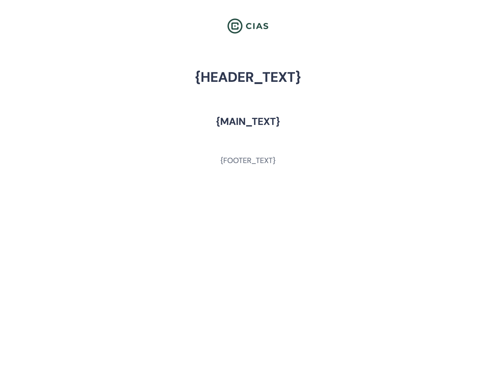
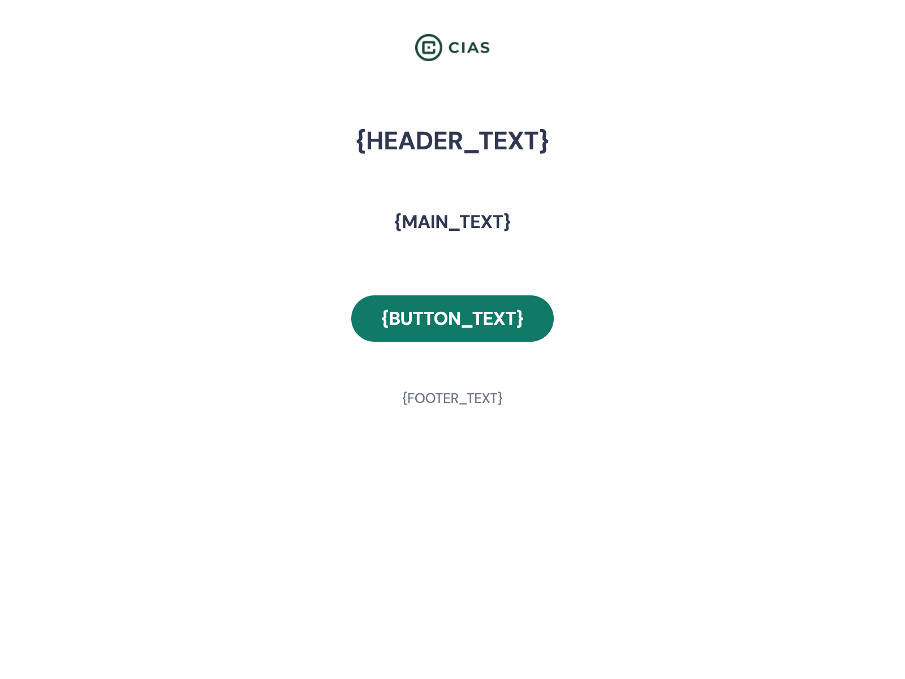
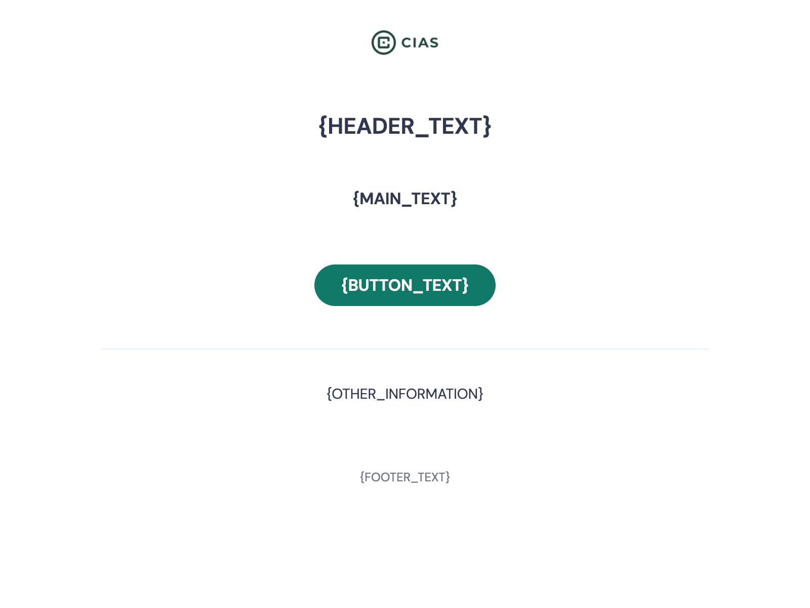
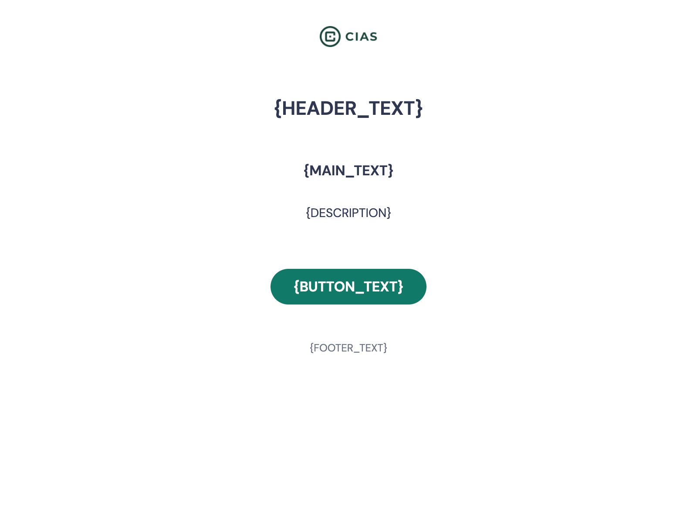
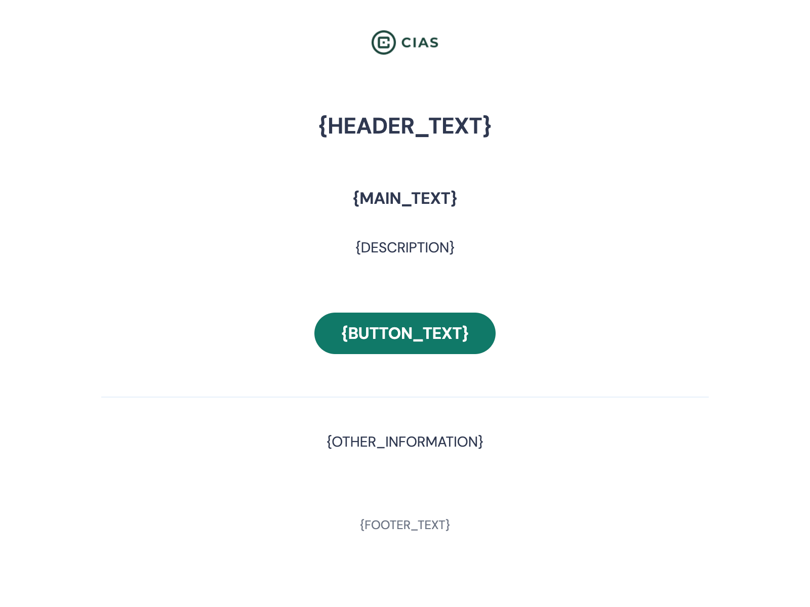

Copyright (C) 2023 Michigan State University

This package is part of CIAS 3.0.

CIAS 3.0 is free software: you can redistribute it and/or modify it under the terms of the GNU General Public License as
published by the Free Software Foundation, either version 3 of the License, or (at your option) any later version.

CIAS 3.0 is distributed in the hope that it will be useful, but WITHOUT ANY WARRANTY; without even the implied warranty
of MERCHANTABILITY or FITNESS FOR A PARTICULAR PURPOSE. See the GNU General Public License for more details.

You should have received a copy of the GNU General Public License along with CIAS 3.0. If not,
see <https://www.gnu.org/licenses/gpl-3.0.html>.

# [CIAS 3.0](https://www.cias.app/)

CIAS 3.0 platform source code is divided into two separate repositories:
- [Frontend package](https://github.com/Michigan-State-University/cias-web#readme) - <b>current</b>
- [Backend package](https://github.com/Michigan-State-University/cias-api#readme)

## Digital Behavioral Health Interventions Made Easy

CIAS stands for Computerized Intervention Authoring System. CIAS gives you the ability to create and manage
multi-session interventions without writing a single line of code. With this robust platform, you can develop and
deliver interventions, collect data, and collaborate with colleagues all in one place.

## User-Friendly Features

The CIAS platform has a variety of features to support a broad range of interventions and approaches, including:

- Variety of **question types** to choose from
- An **animated narrator** to act as a guide
- The ability to speak out loud using high-quality text to speech
- Optional quick exit feature for participant safety
- Automatic **translation** into over 100 languages
- **Tailored reports** for participants and clinicians
- Custom and tailored **SMS messaging**
- **Branching** and **Randomization**
- Synchronous natural language reflections and summaries
- **Scheduled** session sending
- Custom **charts** for data visualisation
- HIPAA and WCAG 2.0 compliant
- Timeline Followback Method Assessment (**TLFB**)
- Secure **Live chat** connecting participants with a peer, CHW, BHC, etc.
- Integrations with 3rd party systems:
  - **CAT-MH<sup>TM</sup>**
  - Epic on FIHR (forthcoming)

For more information about CIAS 3.0 features please see https://www.cias.app.

## Full Version Available for Free*

Our goal is for cost to never be a barrier. This code is available to anyone at no cost. Further, Michigan State University currently provides an instance of CIAS 3.0 that is available at low or no cost for non-commercial use by researchers at universities or non-profit research institutions. Immediate access is always provided without charge and without paperwork, and CIAS remains free for unfunded projects. (edited) 

*A small annual fee will be requested for funded projects.

### For more information, or to request access to the MSU instance of CIAS, please see https://www.cias.app/ or contact [CIAS@msu.edu](cias@msu.edu)

## Install & Start

### <span style="color:red">This is a frontend package only. For CIAS to work, you need the backend package too.</span> You can find it on GitHub [here](https://github.com/Michigan-State-University/cias-api#readme). Follow the instructions there to set up the backend project first.

### Requirements:

- [`Node.js` (v14 or later)](https://nodejs.org/en/download)*
- compatible [`npm` version (v6 or later)](https://github.com/npm/cli)*

*we suggest using node.js version management utility, for instance [nvm](https://github.com/nvm-sh/nvm)

### Steps to install & start the project:

1. Clone or download the repository
1. Go into the root directory of the project
1. Copy the contents of `.env.example` to `.env` (create this file)
1. (Optional) Adjust environmental variables in that exists in `.env`
1. (Optional) Run `npm install` to install all required dependencies => run only the first time or when dependencies
   change
1. Run `npm start` to run the project. When you see a command "webpack built ..." the project is ready
1. Open http://localhost:4200 (by default) in the internet browser
1. If you have the backend project set up too, you can start using CIAS 3.0. If you seeded the database while setting up
   the backend project, you can now log in to one of the accounts that has been automatically created. Please
   see [documentation](https://github.com/Michigan-State-University/cias-api#readme) of the backend project for more information

## Cypress

- Open Cypress dashboard `npm run cy:open`
- Run Cypress tests `npm run cy:test`

## Colors

[COLOR NAME DETECTOR](https://www.color-blindness.com/color-name-hue/)

To name colors in the source code, please do not use custom, made-up names and let's use some kind of color name
detector. There are many
detectors, so to have uniform results let's use that
one: [COLOR NAME DETECTOR](https://www.color-blindness.com/color-name-hue/) as it shows not only the name, but also the
group/hue of a color (useful when there are similar colors).

## Inner HTML

To render HTML elements use `interweave` library. See [DOCS](https://interweave.dev/docs/). It safely renders HTML
elements (tries to protect against XSS).

## MJML

### What is MJML?

A tool for creation of responsive html templates. It handles gotchas of most modern and known email clients.

Take a look at [official documentation](https://mjml.io/documentation/#getting-started).

3 examples can be found in `mjml/examples` directory. Each of them introduce new features, so they should be checked in
this order : `MjBasicComponent`, `MjImageText`, `MjLayout`.

For more complex examples, have a look at standard MJML components code such
as [mj-carousel](https://github.com/mjmlio/mjml/tree/master/packages/mjml-accordion).

### Getting started

A step-by-step tutorial is
available [here](https://medium.com/mjml-making-responsive-email-easy/tutorial-creating-your-own-component-with-mjml-4-1c0e84e97b36)
.

- Go into `mjml` directory
- `npm install` inside
- Add your components inside `components` folder
- Components have to be added in `.mjmlconfig`
- Use your own component in `templates/*.mjml`
- `npm run build` to build, or `npm start` if you want to watch recompile on change you make (to your component or
  to `templates/*.mjml`)
- The result will be outputted in `html/*.html`

### Information for backend developers

- Generated htmls are in `mjml/html` directory

### Available Templates

1. no-button <br/>
   
1. with-button <br/>
   
1. with-button-and-other-information <br/>
   
1. with-button-and-description <br/>
   
1. with-button-and-other-information-and-description <br/>
   

### Tags

For easier maintaining and searching for proper sections and variables, there are tags in `.html` files:

1. `LOGO START` and `LOGO END`
2. `HEADER START` and `HEADER END`
3. `MAIN-TEXT START` and `MAIN-TEXT END`
4. `BUTTON START` and `BUTTON END`
5. `FOOTER START` and `FOOTER END`
6. `OTHER INFORMATION START` and `OTHER INFORMATION END`
7. `DESCRIPTION START` and `DESCRIPTION END`

### Variables:

- _`no-button`_: **`{HEADER_TEXT}`**, **`{MAIN_TEXT}`**, **`{FOOTER_TEXT}`**,
- _`with-button`_: **`{HEADER_TEXT}`**, **`{MAIN_TEXT}`**, **`{BUTTON_TEXT}`**, **`{BUTTON_URL}`**, **`{FOOTER_TEXT}`**,
- _`with-button-and-other-information`_: **`{HEADER_TEXT}`**, **`{MAIN_TEXT}`**, **`{BUTTON_TEXT}`**, **`{BUTTON_URL}`
  **, **`{FOOTER_TEXT}`**, **`{DESCRIPTION}`**,
- _`with-button-and-description`_: **`{HEADER_TEXT}`**, **`{MAIN_TEXT}`**, **`{BUTTON_TEXT}`**, **`{BUTTON_URL}`**, *
  *`{FOOTER_TEXT}`**, **`{OTHER_INFORMATION}`**,
- _`with-button-and-other-information-and-description`_: **`{HEADER_TEXT}`**, **`{MAIN_TEXT}`**, **`{BUTTON_TEXT}`**, *
  *`{BUTTON_URL}`**, **`{FOOTER_TEXT}`**, **`{DESCRIPTION}`**, **`{OTHER_INFORMATION}`**,

In all templates there is a common **`{LOGO_URL}`** variable.

### Styling in email templates

You will need to add proper html tags with styles to style inline text within email variables. For example, MAIN_TEXT
variable can be:

```
  You have been invited to <span style='color: #c866ea;'>Screening Test</span>.
```

To add a new line inside a text block (eg. MAIN_TEXT), please add a double break, for example:

```
  You have been invited to <span style='color: #c866ea;'>Screening Test</span>.<br /><br />Click below to start the session.
```

#### Report templates are in `template` directory

There is `template.html` with all the sections etc. and `sample_template.html` file to show example of a report.

# Contributors

<!-- ALL-CONTRIBUTORS-LIST:START -->
<!-- prettier-ignore-start -->
<!--suppress ALL:START -->
<table>
  <tr>
    <td align="center"><a href="https://github.com/michal-grzelak">
      
      <br /><sub><b>Michał Grzelak</b></sub></a><br />
    </td>
    <td align="center"><a href="https://github.com/PiotrSokolinski">
      
      <br /><sub><b>Piotr Sokoliński</b></sub></a><br />
    </td>
    <td align="center"><a href="https://github.com/msniecHTD">
      
      <br /><sub><b>Michał Śnieć</b></sub></a><br />
    </td>
    <td align="center"><a href="https://github.com/Jakub-Zygmunt">
      
      <br /><sub><b>Jakub Zygmunt</b></sub></a><br />
    </td>
    <td align="center"><a href="https://github.com/sflejszman">
      
      <br /><sub><b>Sebastian Flejszman</b></sub></a><br />
    </td>
        <td align="center"><a href="https://github.com/bartosz-kepka-htd">
      
      <br /><sub><b>Bartosz Kępka</b></sub></a><br />
    </td>
    <td align="center"><a href="https://github.com/mkjedrzejewska">
      
      <br /><sub><b>Klara Jędrzejewska</b></sub></a><br />
    </td>
    <td align="center"><a href="https://github.com/maciej-gorski">
      
      <br /><sub><b>Maciej Górski</b></sub></a><br />
    </td>
  </tr>
</table>

<!--suppress ALL:END -->
<!-- prettier-ignore-end -->

<!-- ALL-CONTRIBUTORS-LIST:END -->
